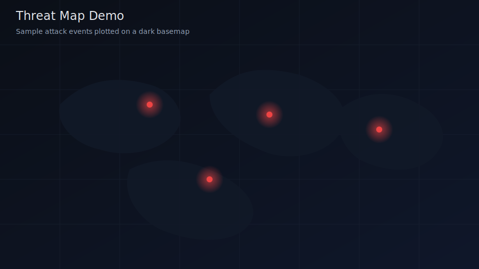

# Threat Maps


[](LICENSE)
[](https://www.python.org/downloads/)
[](CONTRIBUTING.md)
[](https://github.com/Sneaky-the-Slider/threat-maps/actions/workflows/ci.yml)

A collection of resources, scripts, data samples, and references for building/visualizing **cyber threat maps** (live attack visualizations, honeypot logs, IOC geo-mapping, etc.).

## Purpose
This repo serves as a personal/team reference for:
- Threat intelligence feeds with geo-location data
- Map visualization libraries and examples
- Sample code to fetch, process, and display attacks on a world map
- Useful datasets and tools

## What Is a Threat Map?
Threat maps (also called cyber threat maps, cyberattack maps, or live threat visualizations) are interactive or dynamic graphical representations, usually on a world map, that show cybersecurity threats and attacks in real time or near real-time. They make massive volumes of threat data more understandable by turning raw logs, sensor alerts, and intelligence feeds into visual patterns.

## What They Typically Visualize
- Geographic origins and destinations of attacks (source IP country to target country)
- Attack volume or frequency (thousands or millions of events per day/hour)
- Types of threats (malware infections, DDoS, phishing attempts, exploits, botnet traffic, intrusions)
- Severity levels (often color-coded: low/medium/high)
- Targeted industries or countries (higher hits on utilities, education, finance)
- Live or recent connections shown as animated lines, beams, or arcs

## How Threat Maps Work (Data Flow)
1. Data collection from sensors such as honeypots, firewalls, IDS/IPS, endpoint agents, cloud telemetry, and threat intel feeds
2. Geolocation where IPs are mapped to approximate countries or cities (accuracy varies; VPNs/proxies can obscure origins)
3. Aggregation and analysis to filter, categorize, and enrich events with context
4. Visualization using frontend libraries like D3.js, Leaflet, Mapbox GL, or Three.js for 3D effects
5. Updates in real time or near real time via polling or WebSockets

## Public Examples
- Kaspersky Cyberthreat Real-Time Map
- Check Point ThreatCloud
- FortiGuard Labs map
- Recorded Future threat landscape views

## Value and Common Use Cases
- Awareness and demos for non-technical stakeholders
- Trend spotting for emerging campaigns or regional spikes
- Threat intelligence overviews before deep SIEM analysis
- Marketing and education

## Important Limitations
- Not comprehensive; visibility is limited to the provider's sensors
- Mostly noise or low severity; many events are scans or brute force attempts
- Geolocation caveats; origins often point to proxies or compromised hosts
- Can mislead; dramatic visuals may overstate immediacy or risk

## Honeypots
Honeypots are decoy systems or services designed to appear vulnerable and attractive to attackers. They lure malicious actors away from real assets while capturing detailed information about behavior, tools, tactics, techniques, and procedures (TTPs). They are a common upstream feed for threat maps because they provide real attacker IPs, timestamps, and attack types that can be enriched and visualized.

See [docs/honeypots.md](docs/honeypots.md) for a full overview, classifications, tooling, and operational considerations.

## Preview


## Installation
1. Create and activate a virtual environment (optional but recommended).
```sh
python -m venv .venv
. .venv/bin/activate
```
2. Install Python dependencies.
```sh
pip install -r requirements.txt
```
3. Create a local output directory for JSON artifacts.
```sh
mkdir -p data
```

## Configuration
Copy the example environment file and fill in your API keys:
```sh
cp .env.example .env
```

Required environment variables (see [`.env.example`](./.env.example)):
- `IPINFO_TOKEN` - IP geolocation
- `GREYNOISE_KEY` - GreyNoise threat intel
- `OTX_API_KEY` - AlienVault OTX
- `ABUSEIPDB_KEY` - AbuseIPDB reputation checks
- `MAPBOX_TOKEN` - Map visualizations

## Usage
### Fetch Geo Data for a Single IP
```sh
python src/fetch_threat_data.py --ip 8.8.8.8 --output data/ip_lookup.json
```

### Enrich a List of IPs via GreyNoise Community
```sh
python src/fetch_threat_data_greynoise.py --input ips.txt --output data/greynoise_enriched.json --enrich-geo
```

### Run a GNQL Query (Enterprise Key Required)
```sh
python src/query_greynoise_gnql.py --api-key YOUR_KEY --query "classification:malicious last_seen:>now-7d" \
  --output data/gnql_results.json
```

### Pull OTX TAXII STIX 1.x Indicators
```sh
python src/fetch_threat_data_otx_taxii_stix.py --api-key YOUR_KEY --collection user_yourusername \
  --output data/otx_taxii_stix.json --enrich-geo
```

### Map Demo (HTML)
1. Start a local server.
```sh
python -m http.server 8000
```
2. Open the demo map in a browser.
```text
http://localhost:8000/src/generate_map.html
```


## Project Status

This project is in **prototype** stage. Scripts work individually against live APIs, but there is no unified pipeline or production deployment yet. Contributions and feedback are welcome.

## Features / Planned
- [ ] Live threat feed ingestion (e.g., from AlienVault OTX, GreyNoise, etc.)
- [ ] World map visualizations (D3.js, Leaflet, Mapbox GL)
- [ ] Sample honeypot attack logs → geo-mapped
- [ ] Offline-capable map examples

## Data Sources & Feeds
See [docs/data-sources.md](./docs/data-sources.md) for the full list.

## Tools & Libraries Commonly Used
- D3.js + Datamaps / topojson for SVG-based attack maps
- Leaflet.js or OpenLayers for interactive web maps
- Mapbox GL JS (great for dark-themed cyber maps)
- Three.js/WebGL for 3D globe effects (if you want fancy globe visuals)

## License
MIT License

## Contributing
See [CONTRIBUTING.md](./CONTRIBUTING.md) if you'd like to add feeds, scripts, or fixes.
